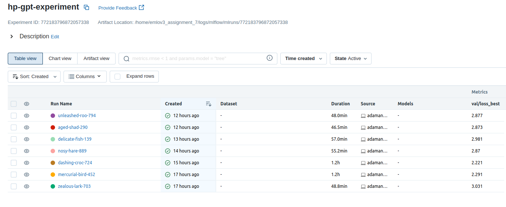
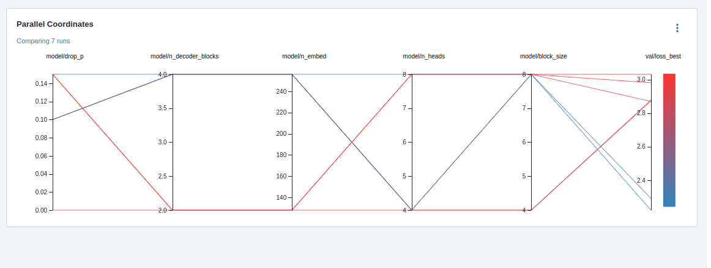
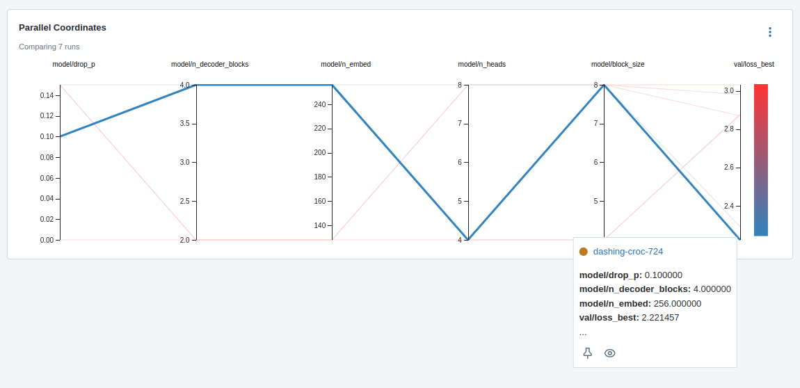
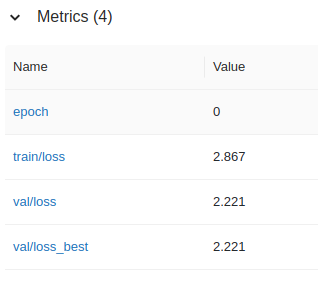

# EMLOv3 | Assignment 7

[](https://pytorch.org/get-started/locally/)
[](https://pytorchlightning.ai/)
[](https://hydra.cc/)
[](https://black.readthedocs.io/en/stable/)


## Adamantium 

<em>The name is inspired by the metal alloy which is bonded to the character Wolverine's skeleton and claws.</em>

Adamantium is a custom python package which currently supports:
- Usage of any model available in TIMM for training & evalution on CIFAR10 dataset. 
- VIT model for training, evaluation & inference on Cats-Dogs & CIFAR10 dataset.
- GPT model training and optuna based hyperparameter optimization over Harry Potter books dataset.
- Experiment tracking using MLFlow, AIM, Tensorboard & CSV logger.

All functionalities can be controlled by hydra configs.

## Optuna Hyperparameter Optimization

To run optuna hyperparameter optimization for GPT model, run the following command:
```bash
adamantium_train -m experiment=hp_gpt data.num_workers=2 tuner=False
```

Best Hyperparameters:
```yaml
  n_embed: 256
  n_heads: 4
  n_decoder_blocks: 4
  drop_p: 0.1
  block_size: 8
```







Best val/loss_best: 2.221

Note - A6000 GPU was used for training with a budget cap of 10$, hence less trails but paramters with higher values were tested.


## Best Hyperparameters for 10 Epochs

To run training for 10 epochs with best hyperparameters, run the following command:
```bash
adamantium_train experiment=hp_gpt_best data.num_workers=4
```

```yaml
    learning_rate: 0.001096
    batch_size: 2048
```
1 epoch took 1.2hrs on A6000 GPU, estimated time for 10 epochs was ~12hrs. Hence the idea was dropped.

### Best Model Metrics - 1 Epoch



## Past Documentation

- [Assignment 4](https://github.com/salil-gtm/emlov3_assignment_4)
- [Assignment 5](https://github.com/salil-gtm/emlov3_assignment_5)
- [Assignment 6](https://github.com/salil-gtm/emlov3_assignment_6)

## Author

- Salil Gautam